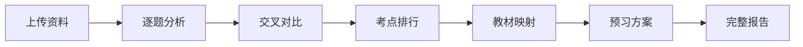

# 初中英语考试反向预习系统 V2.0 - 产品需求文档

## 1. 产品概述

初中英语考试反向预习系统是一款专为基础薄弱的初二学生设计的智能学习工具，通过分析考试试卷反推核心考点，生成精准的预习路线图。

- **核心价值**：以试卷为最高权重，让学生知道"考试真正关注什么"，避免盲目学习
- **目标用户**：英语基础薄弱的初中学生（重点初二）
- **解决痛点**：学生不知道学什么、怎么学，花费大量时间却抓不住考试重点

## 2. 核心功能

### 2.1 用户角色

| 角色 | 注册方式 | 核心权限 |
|------|----------|----------|
| 学生用户 | 无需注册，本地使用 | 上传资料、生成分析报告、查看预习方案 |

### 2.2 功能模块

1. **资料上传页**：上传教材、试卷、教案、笔记
2. **逐题分析页**：拆解每道题的考查目标和知识点
3. **交叉分析页**：多份试卷对比，生成考点排行榜
4. **预习地图页**：反向生成预习知识地图
5. **教材映射页**：考点与教材内容对应
6. **预习方案页**：30分钟针对性预习方案
7. **报告总览页**：完整的反向预习报告

### 2.3 页面详情

| 页面名称 | 模块名称 | 功能描述 |
|----------|----------|----------|
| 首页/仪表盘 | 课程列表 | 展示已分析的课程，快速进入 |
| 首页/仪表盘 | 新建分析 | 入口按钮，引导上传资料 |
| 资料上传页 | 文件上传区 | 拖拽或点击上传教材、试卷、教案、笔记 |
| 资料上传页 | 资料清单 | 已上传文件列表，可删除、重命名 |
| 逐题分析页 | 题目列表 | 所有题目概览，可筛选题型/分值 |
| 逐题分析页 | 题目详情 | 基础信息、表面考查、深层目标、知识点、错误风险 |
| 交叉分析页 | 考点排行榜 | ★★★★★到★★★分级展示核心考点 |
| 交叉分析页 | 证据链展示 | 每个考点对应的试卷、题号、依据 |
| 预习地图页 | 知识卡片 | 每个重点的学习内容、常见错误、不需深入的部分 |
| 教材映射页 | 对应表 | 知识点→教材位置→预习内容的映射 |
| 预习方案页 | 时间轴 | 0-10/10-20/20-30分钟分段学习计划 |
| 预习方案页 | 课堂提醒 | 明天听课重点提醒 |
| 报告总览页 | 七部分完整报告 | 试卷分析、考点排行、证据链、教材映射、预习计划、风险提醒、AI判断说明 |

## 3. 核心流程

用户上传教材和多份试卷 → 系统逐题分析每道题的考查目标 → 交叉对比生成考点排行榜 → 映射教材内容 → 生成30分钟预习方案 → 输出完整报告

## 4. 用户界面设计

### 4.1 设计风格

- **主色调**：深蓝色（#1e3a5f）+ 暖橙色（#f59e0b）—— 深蓝色代表知识的深度，暖橙色代表学习的热情
- **辅助色**：薄荷绿（#10b981）表示掌握，珊瑚红（#ef4444）表示错误风险
- **按钮风格**：圆角矩形，轻微阴影，悬停有上浮动画
- **字体**：标题用思源黑体Bold，正文用思源宋体Regular，营造教科书般的严谨感
- **布局风格**：卡片式布局，清晰的视觉层级，重点内容用星级标识突出
- **图标风格**：线性图标，简洁明了，配合emoji增加亲和力

### 4.2 页面设计概览

| 页面名称 | 模块名称 | UI元素 |
|----------|----------|--------|
| 首页 | Hero区 | 大标题+副标题，考试反向预习的核心概念视觉化 |
| 首页 | 课程卡片 | 课程名称、分析日期、考点数量星级展示 |
| 资料上传 | 上传区 | 虚线边框拖拽区，文件类型图标引导 |
| 逐题分析 | 题目卡片 | 题号标签、题型标签、分值徽章、星级重要度 |
| 交叉分析 | 排行榜 | 星级进度条、考点名称、证据数量徽章 |
| 预习方案 | 时间轴 | 三段式时间线，每段有目标和内容卡片 |
| 报告页 | 目录导航 | 左侧固定目录，右侧内容区域滚动 |

### 4.3 响应式

- 桌面端优先设计（1280px及以上）
- 平板端适配（768px-1279px）：卡片自适应排列
- 移动端适配（<768px）：单列布局，简化导航

### 4.4 动效设计

- 页面切换：淡入淡出 + 轻微位移动画
- 卡片悬停：轻微上浮 + 阴影加深
- 星级展示：逐星点亮动画
- 进度条：从左到右填充动画
- 报告生成：骨架屏加载效果
