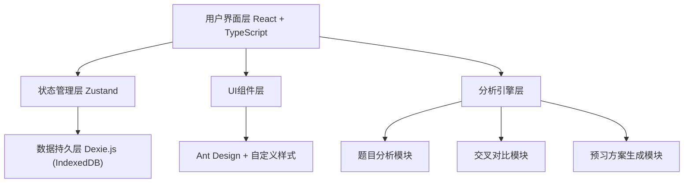

# 初中英语考试反向预习系统 V2.0 - 技术架构文档

## 1. 架构设计



## 2. 技术描述

- **前端框架**：React 18 + TypeScript 5
- **构建工具**：Vite 5
- **状态管理**：Zustand（轻量级，适合本地应用）
- **数据存储**：Dexie.js（IndexedDB封装，本地持久化）
- **UI组件库**：Ant Design 5（按需引入）
- **样式方案**：Tailwind CSS 3 + CSS Modules
- **路由**：React Router 6
- **图表**：Recharts（用于考点分布可视化）
- **富文本/Markdown**：react-markdown（报告展示）
- **文件处理**：FileReader API（本地文件读取，不上传服务器）

**设计原则**：纯前端应用，所有数据本地存储，保护用户隐私，无需后端服务。

## 3. 路由定义

| 路由 | 页面 | 用途 |
|------|------|------|
| / | 首页/仪表盘 | 课程列表、新建分析入口 |
| /upload | 资料上传页 | 上传教材、试卷、教案、笔记 |
| /analysis/:id/questions | 逐题分析页 | 题目列表和详情 |
| /analysis/:id/cross | 交叉分析页 | 考点排行榜、证据链 |
| /analysis/:id/map | 预习地图页 | 知识卡片 |
| /analysis/:id/textbook | 教材映射页 | 教材对应表 |
| /analysis/:id/plan | 预习方案页 | 30分钟方案、课堂提醒 |
| /analysis/:id/report | 报告总览页 | 完整七部分报告 |

## 4. 数据模型

### 4.1 数据模型定义

```mermaid
erDiagram
    COURSE ||--o{ EXAM_PAPER : has
    COURSE ||--o| TEXTBOOK : has
    COURSE ||--o| TEACHING_PLAN : has
    COURSE ||--o| CLASS_NOTES : has
    EXAM_PAPER ||--o{ QUESTION : contains
    QUESTION ||--o{ KNOWLEDGE_POINT : tests
    COURSE ||--o{ KNOWLEDGE_RANKING : generates
    COURSE ||--o| PREVIEW_PLAN : generates
    COURSE ||--o| REPORT : generates

    COURSE {
        string id PK
        string name
        string unit
        datetime createdAt
        datetime updatedAt
    }

    EXAM_PAPER {
        string id PK
        string courseId FK
        string name
        string fileType
        int totalScore
        int questionCount
    }

    TEXTBOOK {
        string id PK
        string courseId FK
        string name
        string unit
        string section
    }

    TEACHING_PLAN {
        string id PK
        string courseId FK
        string name
    }

    CLASS_NOTES {
        string id PK
        string courseId FK
        string name
    }

    QUESTION {
        string id PK
        string paperId FK
        int number
        string type
        int score
        string surfaceContent
        string deepGoal
        string judgmentBasis
        string errorRisk
    }

    KNOWLEDGE_POINT {
        string id PK
        string questionId FK
        string level1
        string level2
        string level3
    }

    KNOWLEDGE_RANKING {
        string id PK
        string courseId FK
        int rank
        int stars
        string name
        int appearCount
        string questionTypes
        string reason
        string evidence JSON
    }

    PREVIEW_PLAN {
        string id PK
        string courseId FK
        JSON section1
        JSON section2
        JSON section3
        string classReminders
    }

    REPORT {
        string id PK
        string courseId FK
        string overallAnalysis
        string knowledgeRankings
        string evidenceChain
        string textbookMapping
        string previewPlan
        string riskWarnings
        string aiJudgment
    }
```

### 4.2 核心数据结构（TypeScript）

```typescript
// 课程
interface Course {
  id: string;
  name: string;
  unit: string;
  createdAt: Date;
  updatedAt: Date;
}

// 试卷
interface ExamPaper {
  id: string;
  courseId: string;
  name: string;
  fileType: 'pdf' | 'image' | 'text';
  totalScore: number;
  questionCount: number;
  questions: Question[];
}

// 题目
interface Question {
  id: string;
  paperId: string;
  number: number;
  type: 'choice' | 'fill' | 'reading' | 'writing' | 'translation';
  score: number;
  surfaceContent: string;
  deepGoal: string;
  judgmentBasis: string;
  errorRisk: string;
  knowledgePoints: KnowledgePoint[];
}

// 知识点
interface KnowledgePoint {
  level1: 'grammar' | 'vocabulary' | 'reading' | 'writing';
  level2: string;
  level3: string;
}

// 考点排行
interface KnowledgeRanking {
  id: string;
  courseId: string;
  rank: number;
  stars: 3 | 4 | 5;
  name: string;
  appearCount: number;
  questionTypes: string[];
  reason: string;
  evidence: Array<{
    paperName: string;
    questionNumber: number;
  }>;
}

// 预习方案
interface PreviewPlan {
  section1: {
    title: string;
    duration: string;
    goal: string;
    content: string[];
  };
  section2: {
    title: string;
    duration: string;
    goal: string;
    content: string[];
  };
  section3: {
    title: string;
    duration: string;
    goal: string;
    content: string[];
  };
  classReminders: string[];
}

// 完整报告
interface FullReport {
  overallAnalysis: string;
  knowledgeRankings: KnowledgeRanking[];
  evidenceChain: string;
  textbookMapping: Array<{
    knowledge: string;
    textbookPosition: string;
    previewContent: string[];
  }>;
  previewPlan: PreviewPlan;
  riskWarnings: string[];
  aiJudgment: {
    confirmed: string[];
    inferred: string[];
    pending: string[];
  };
}
```

## 5. 核心模块设计

### 5.1 分析引擎模块

- **题目分析器**：根据题目内容智能判断考查目标（模拟AI分析，内置规则引擎）
- **交叉对比器**：多份试卷知识点交叉验证，计算考点权重
- **权重算法**：综合频率(40%) + 分值(30%) + 题型重要度(20%) + 重复度(10%)

### 5.2 预习方案生成器

- 根据考点排行榜自动生成30分钟分段计划
- 自动匹配教材内容映射
- 生成课堂听课提醒

### 5.3 数据持久化

- 使用Dexie.js管理IndexedDB
- 课程、试卷、题目、报告等数据全部本地存储
- 支持导出/导入JSON备份

## 6. 性能优化

- 懒加载：路由级代码分割
- 虚拟列表：题目列表数量多时使用虚拟滚动
- 本地缓存：分析结果缓存，避免重复计算
- 图片优化：上传图片压缩预览
